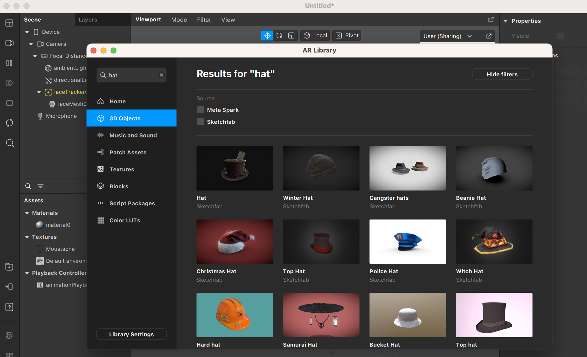

En esta sección veremos cómo hacer efectos con objetos 3D y cómo animarlos, incluyendo Blendshapes.

Empecemos por hacer un efecto sencillo con un objeto 3D. Pondremos un sombrero encima de la cabeza que detecte el sistema de [FaceTracking](Spark-AR/Face-Tracking). Antes de empezar, vamos a importar el objeto 3D. Podemos usar cualquier fichero propio, o bien explorar la galería de objetos 3D de Sketchfab o Meta Spark
