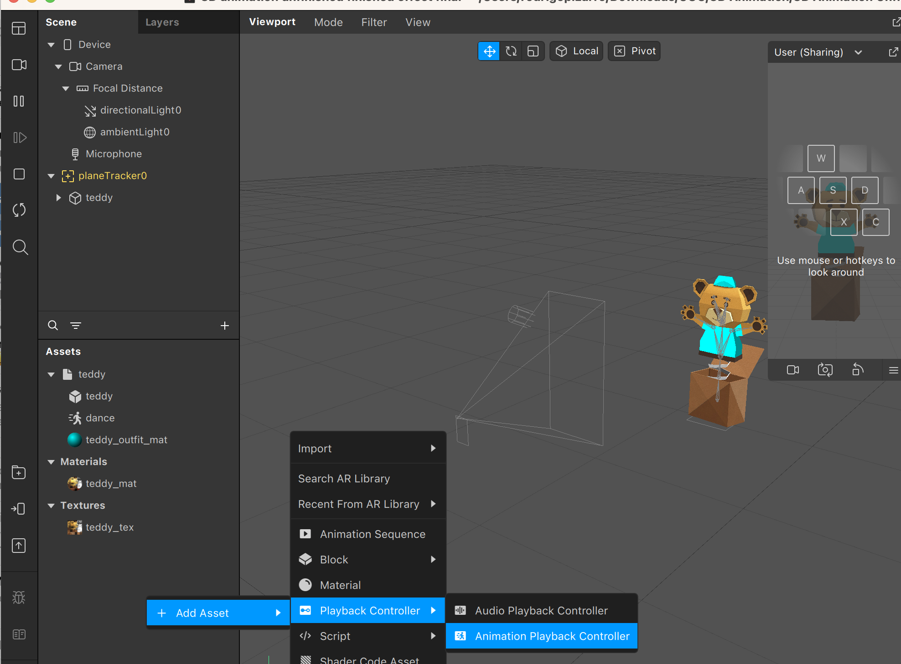
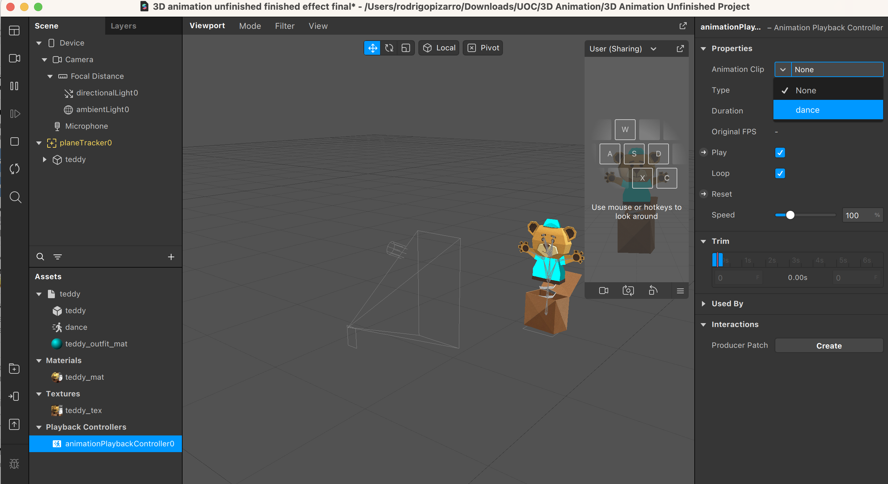
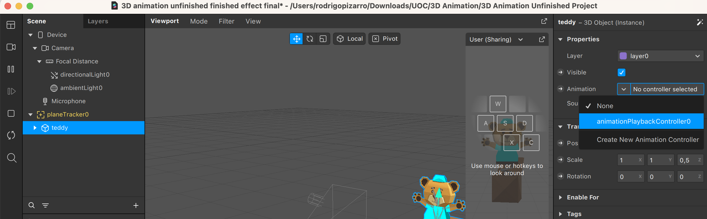
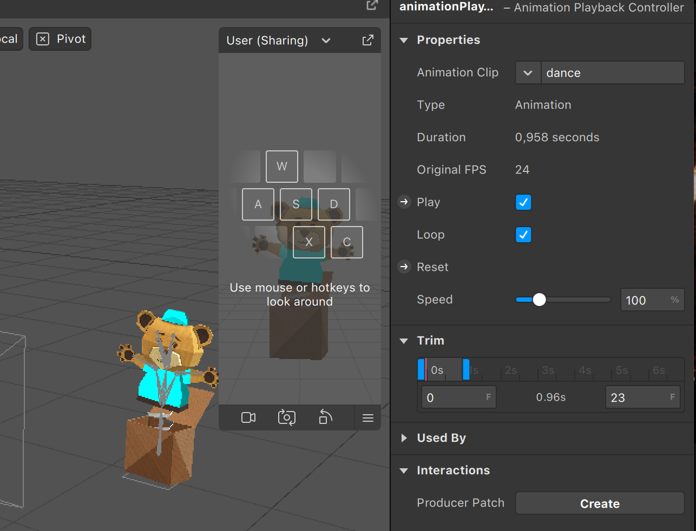
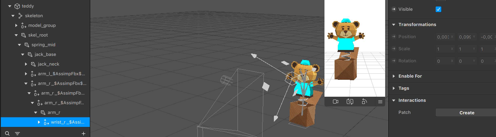
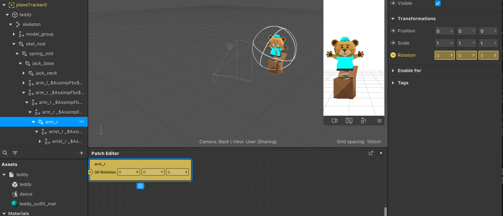
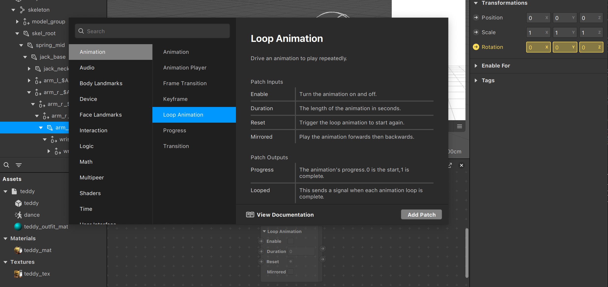
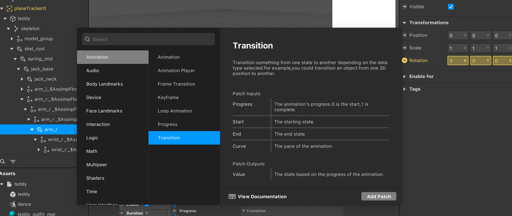
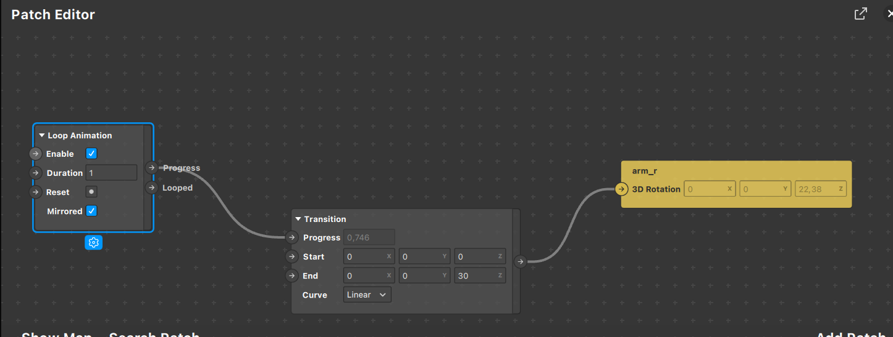

En esta sección, aprenderemos a trabajar con animaciones. El primer paso será bajarnos [este ejemplo](https://sparkar.facebook.com/ar-studio/learn/tutorials/3d-objects-animation) de Meta (la empresa creadora de Spark) para tener una base con los elementos necesarios para ver los diversos aspectos.

Las animaciones en Spark AR se controlan mediante un _animation playback controller_. Creamos uno haciendo clic derecho en la sección de Assets y seleccionando Add Asset -\> Playback Controller -\> Animation Playback Controller: 

Ahora le vamos a indicar al _animation playback controller_ que queremos que gestione la animación que tenemos en el proyecto para el oso de peluche.

Ahora en la sección de Scene vamos a asociar este _animation playback controller_ al oso de peluche. Seleccionamos el objeto Teddy y en el desplegable de la configuración de Animation, clicamos en el objeto que acabamos de crear. 

Veréis que nada más añadir el _controller_, el oso de peluche comenzará a animarse. Tenéis varias opciones disponibles en el  _animation playback controller_ para controlar las animaciones, la mayoría son bastante autoexplicativas.

Una opción aún más interesante es aprender a generar animaciones manualmente. Antes hacerlo, debemos entender la base de cómo funcionan las animaciones.

El primer concepto que debemos entender es _keyframes_. Podemos entender una animación como una serie de posiciones una detrás de la otra durante un intervalo de tiempo. Sería impracticable definir para cada instante, porque el tiempo es continuo. Incluso aunque decidiésemos discretizar el tiempo, tendríamos que decidir cada cuánto tiempo definir cada muestra. Si decidiésemos definirlo, por ejemplo a una velocidad de 60 Hz, en pantallas de 120 Hz tendríamos errores, pero tampoco podríamos estar constantemente subiendo de valor porque el límite sería infinito.

Los _keyframes_ son la solución a este problema. Son en esencia las posiciones relevantes, donde hay algún cambio, y una animación interpola todas las posiciones entre esos _keyframes_. Es decir, si tenemos un _keyframe_ A, B y C, todas las posiciones intermedias entre A y B se calculan con la interpolación de los valores, y lo mismo entre B y C.

El segundo concepto es el de _skeleton_ ('esqueleto'). Supongamos que tenemos un objeto 3D con miles de vértices y lo queremos animar por partes, como, por ejemplo, un humanoide que mueva los brazos independientemente de las piernas. Si tuviéramos que definir cómo se mueven todos los vértices uno a uno, generar animaciones para objetos complejos sería impracticable. Para facilitarnos la tarea necesitamos un _skeleton_. Esta es una estructura de datos que define de manera muy simplificada cómo se mueven los vértices en relación con un punto de referencia o articulación. Por ejemplo, cuando giramos el codo, el antebrazo se desplaza, pero el hombro no. La generación de esqueletos es tarea de quien modele el objeto y se sale del alcance de este tutorial.

En nuestro ejemplo tenemos el Teddy con el esqueleto ya definido. Si vamos recorriendo el objeto seleccionando las flechas, veremos dónde está cada articulación.

Ahora vamos a crear una animación a mano, sin utilizar las animaciones ya definidas en el modelo. El primer paso es borrar el _animation playback controller_, porque, si no, Spark AR siempre lo tomará como el sistema que controla el movimiento del objeto. Seguidamente, haremos clic en la articulación que queremos animar. En este caso, vamos a animar el brazo derecho, por lo que seleccionaremos arm_r. Cuando cliquemos en la flecha de la propiedad de rotación, se nos creará un Patch y veremos el Patch Editor en la parte inferior de Spark Studio.

Patch Editor será nuestro sistema de control de animaciones, en el que definiremos cómo se comporta la animación. Si queremos que salude, necesitaremos que la animación se repita, por lo que vamos a añadir un _loop animation_ a nuestro patch, haciendo clic derecho, seleccionando Loop Animation y Add Patch.

A continuación, vamos a indicarle al Patch Editor que queremos cambiar valores de algún componente. Lo podemos hacer añadiendo una _transition_, que tendremos que conectar.

La idea del Patch Editor es poder hacer cambios visualmente, sin tener que editar código, y consiste en conectar nodos unos con otros. En nuestro caso, queremos que la animación se repita, con lo que vamos a conectar Loop Animation con Transition, en la parte de Progress. Esto le indica a Spark que Loop controla que Transition se repita. También queremos que Transition afecte al brazo y esto lo indicamos conectando la salida de Transition con arm_r, que recordemos controla el brazo de Teddy.

Ahora para indicarle a Spark que queremos que el brazo se mueva, hay que editar los campos de Start y End en el nodo Transition. En concreto, haciendo pruebas podemos ver que, si indicamos que End tenga los valores 0, 0 y 30, queda una animación parecida a un saludo. Solo queda arreglar un problema y es que, al acabar, la animación vuelve instantáneamente al inicio. Lo que queremos es que vuelva al principio suavemente y eso lo podemos hacer marcando la opción de Mirrored en el Loop Animation.

¡Y ya tenemos la animación completa!

---
[Página previa](Objetos-3D.md) - [página siguiente](Patch-Editor.md)

# Versió catalana

En aquesta secció aprendrem a treballar amb animacions. El primer pas serà baixar-nos [aquest exemple](https://sparkar.facebook.com/ar-studio/learn/tutorials/3d-objects-animation) de Meta (l'empresa creadora de Spark) per tenir una base amb els elements necessaris per veure els diversos aspectes.

Les animacions en Spark AR es controlen mitjançant un _animation playback controller_. En creem un fent clic dret en la secció d'Assets i seleccionant Add Asset -\> Playback Controller -\> Animation Playback Controller: 

Ara indicarem a l'_animation playback controller_ que volem que gestioni l'animació que tenim en el projecte per a l'os de peluix.

Ara en la secció Scene associarem aquest _animation playback controller_ a l'os de peluix. Seleccionem l'objecte Teddy i, en el desplegable de la configuració d'Animation, cliquem en l'objecte que acabem de crear. 

Veureu que, tan bon punt afegim el _controller_, l'os de peluix començarà a animar-se. Teniu diverses opcions disponibles en l'_animation playback controller_ per controlar les animacions. La majoria són bastant autoexplicatives.

Una opció encara més interessant és aprendre a generar animacions manualment. Abans fer-ho, hem d'entendre la base de funcionament de les animacions.

El primer concepte que hem d'entendre és _keyframes_. Podem entendre una animació com una sèrie de posicions una darrere l'altra durant un interval de temps. Seria impracticable definir-ho per a cada instant perquè el temps és continu. Fins i tot encara que decidíssim discretitzar el temps, hauríem de decidir cada quant temps definir cada mostra. Si decidíssim definir-lo, per exemple, a una velocitat de 60 Hz, en pantalles de 120 Hz tindríem errors, però tampoc no podríem estar constantment pujant de valor perquè el límit seria infinit.

Els _keyframes_ són la solució a aquest problema. Són, en essència, les posicions rellevants, on hi ha algun canvi, i una animació interpola totes les posicions entre aquests _keyframes_. És a dir, si tenim un _keyframe_ A, B i C, totes les posicions intermèdies entre A i B es calculen amb la interpolació dels valors, i el mateix passa entre B i C.

El segon concepte és el de _skeleton_ ('esquelet'). Suposem que tenim un objecte en 3D amb milers de vèrtexs i el volem animar per parts, com, per exemple, un humanoide que mogui els braços independentment de les cames. Si haguéssim de definir com es mouen tots els vèrtexs un a un, generar animacions per objectes complexos seria impracticable. Per facilitar-nos la tasca, necessitem un _skeleton_. És una estructura de dades que defineix de manera molt simplificada com es mouen els vèrtexs en relació amb un punt de referència o articulació. Per exemple, quan girem el colze, l'avantbraç es desplaça però l'espatlla no. La generació d'esquelets és una tasca de qui modeli l'objecte i surt de l'abast d'aquest tutorial.

En el nostre exemple tenim el Teddy amb l'esquelet ja definit. Si anem recorrent l'objecte seleccionant les fletxes, veurem on està cada articulació.

Ara crearem una animació a mà, sense utilitzar les animacions ja definides en el model. El primer pas és esborrar l'_animation playback controller_ perquè, si no, Spark AR sempre el prendrà com el sistema que controla el moviment de l'objecte. Seguidament, farem clic en l'articulació que volem animar. En aquest cas, animarem el braç dret, per la qual cosa seleccionarem arm_r. Quan cliquem en la fletxa de la propietat de rotació, se'ns crearà un Patch i veurem el Patch Editor en la part inferior d'Spark Studio.

Patch Editor serà el nostre sistema de control d'animacions, en el qual definirem com es comporta l'animació. Si volem que saludi, necessitarem que l'animació es repeteixi, per la qual cosa afegirem un _loop animation_ al nostre patch fent clic dret i seleccionant Loop Animation i Add Patch.

A continuació indicarem al Patch Editor que volem canviar valors d'algun component. Ho podem fer afegint una _transition_, que haurem de connectar.

La idea del Patch Editor és poder fer canvis visualment sense haver d'editar codi i consisteix a connectar nodes els uns amb els altres. En el nostre cas, volem que l'animació es repeteixi, i per això connectarem Loop Animation amb Transition en la part de Progress. Això indica a Spark que Loop controla que Transition es repeteixi. També volem que Transition afecti el braç, i això ho indiquem connectant la sortida de Transition amb arm_r, que recordem que controla el braç de Teddy.

Ara, per indicar a Spark que volem que el braç es mogui, cal editar els camps d'Start i End en el node Transition. En concret, fent proves podem veure que, si indiquem que End tingui els valors 0, 0 i 30, queda una animació semblant a una salutació. Només resta arreglar un problema, i és que, en acabar, l'animació torna instantàniament a l'inici. El que volem és que torni al principi suaument, i això ho podem fer marcant l'opció de Mirrored en el Loop Animation.

I ja tenim l'animació completa!

---
[Pàgina prèvia](Objetos-3D.md) - [pàgina següent](Patch-Editor.md)

