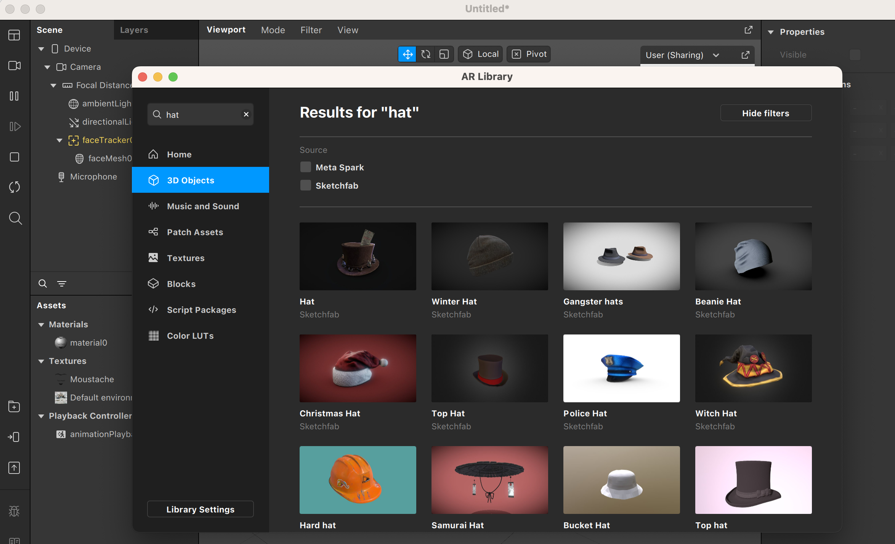
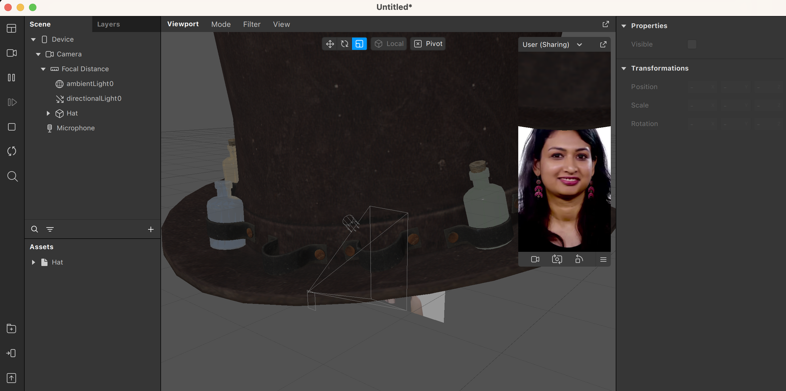

En esta sección veremos cómo hacer efectos con objetos 3D y cómo animarlos, incluyendo Blendshapes.

Empecemos por hacer un efecto sencillo con un objeto 3D. Pondremos un sombrero encima de la cabeza que detecte el sistema de [FaceTracking](Spark-AR/Face-Tracking). Antes de empezar, vamos a importar el objeto 3D. Podemos usar cualquier fichero propio, o bien explorar la galería de objetos 3D de Sketchfab o Meta Spark. Para hacer pruebas recomendamos utilizar estas galerías, ya que contienen una gran cantidad de objetos, y la mayoría se pueden descargar de manera gratuita. Accederemos a estas galerías apretando el botón con el símbolo + encima de una carpeta, en la parte inferior izquierda. Seguidamente, podemos usar el buscador situado en la parte superior izquierda para filtrar lo que estamos buscando  Si escogéis un objeto de Sketchfab tendréis que aceptar las condiciones y luego importar el objeto. En este ejemplo, escogemos un sombrero de copa con un billete del titanic. Lo podemos añadir a la escena simplemente arrastrándolo desde la sección de Assets a la sección de Scene.Como podéis comprobar, el sombrero tiene unas dimensiones inadecuadas. Esto se debe a que simplemente se modeló en otra escala (por ejemplo hay programas de modelado donde cada unidad representa 10cm, y otros donde representa 1m), y tenemos que ajustarlo a la escala de nuestro proyecto. Una escala de unos 0.12 en cada eje se verá correcta