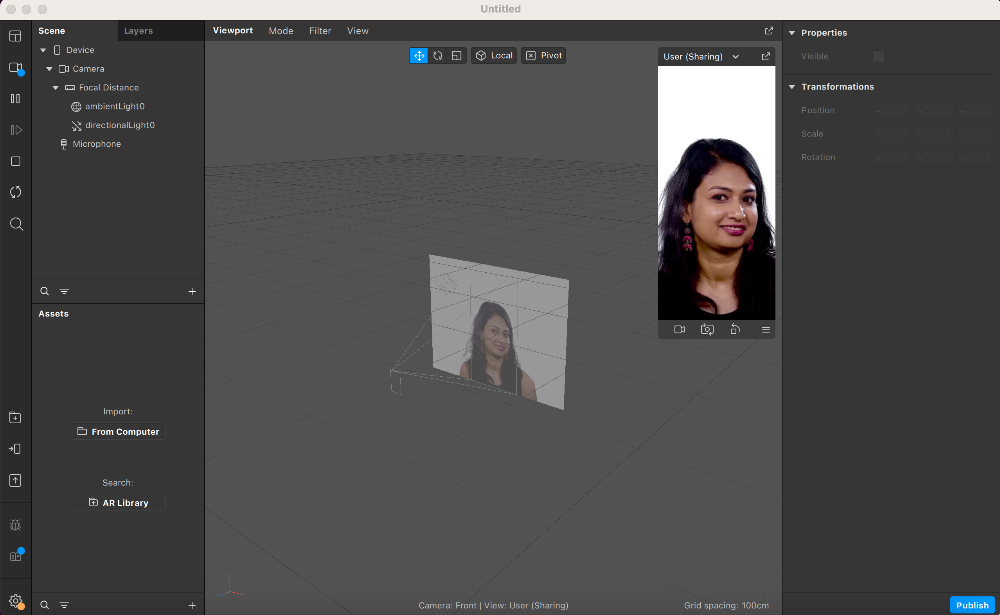
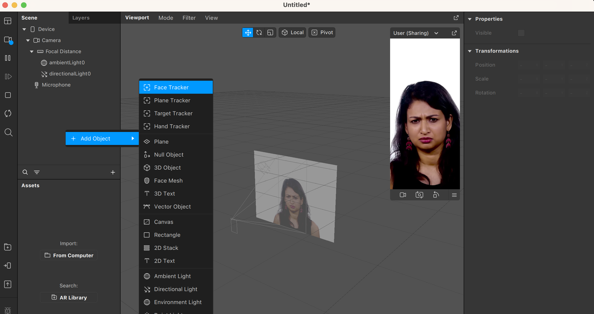
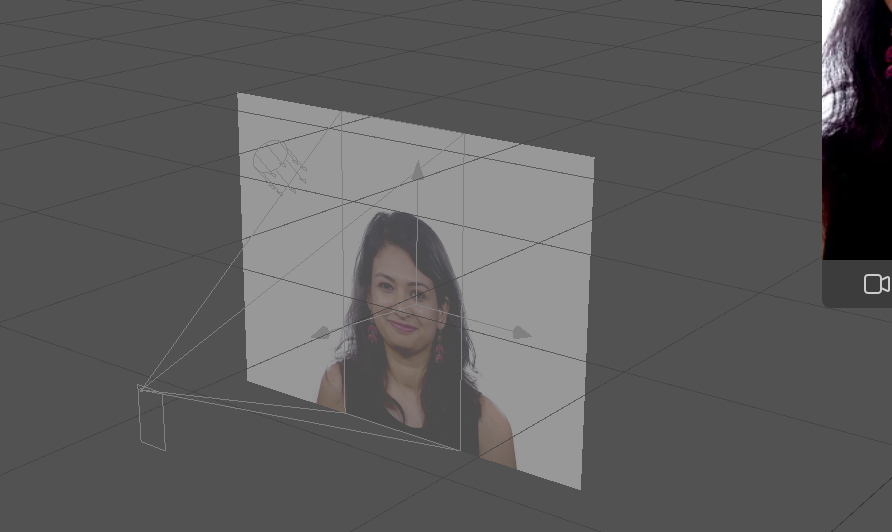

En esta sección veremos qué herramientas nos ofrece Spark AR para hacer un seguimiento de una cara y poder aplicar efectos en ella.

Antes de empezar, vamos a aclarar qué significa Face tracking en este contexto. Spark AR está pensado para desarrollar aplicaciones que se ejecuten en dispositivos móviles, usando la cámara para mostrar información o efectos digitales sobre el mundo real. En el caso de Face tracking cuando la cámara detecte un rostro, activará las funciones que se hayan programado. Internamente un sistema de Face tracking detecta la posición y orientación de la cara respecto de la cámara, y ofrece esta información a los sistemas que se hayan integrado en la aplicación. Vamos a ver ejemplos prácticos de cómo utilizar el Face tracking de Spark AR.

Empezaremos abriendo un proyecto nuevo en Spark Studio  

Podéis ver que el proyecto ya viene configurado con un ejemplo de vídeo para simular lo que podría estar viendo una cámara. Añadir Face tracking es tan simple como apretar el botón derecho del ratón en la zona de la escena.

Veréis como después de añadir el face tracking la imágen en el viewport incluye los ejes que indican la orientación del rostro detectado

