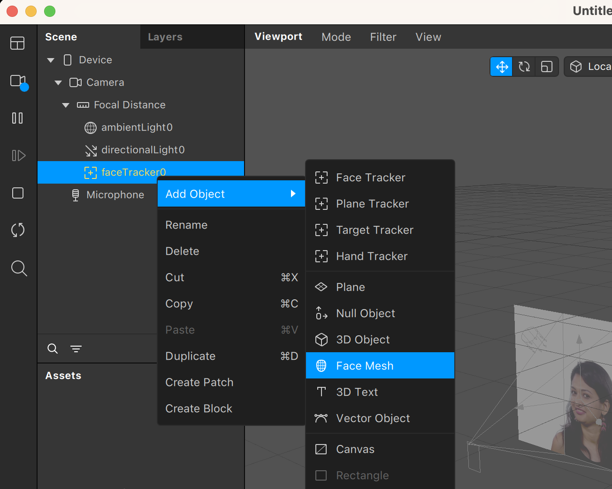
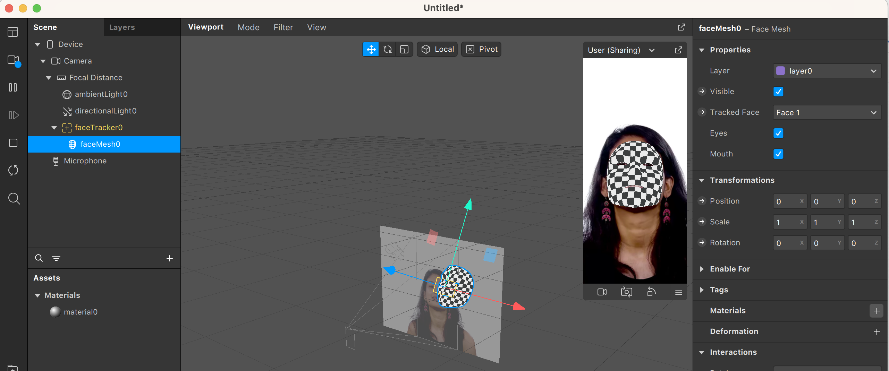
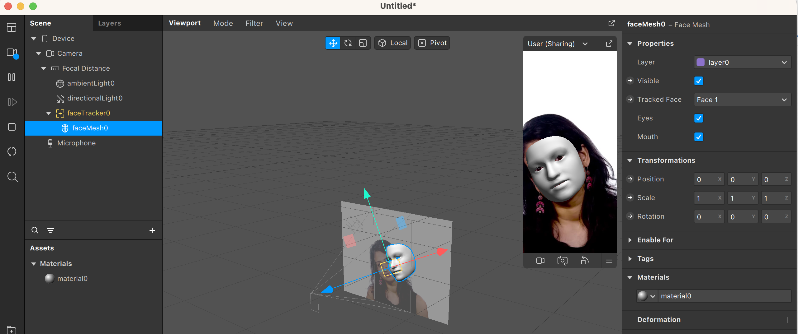
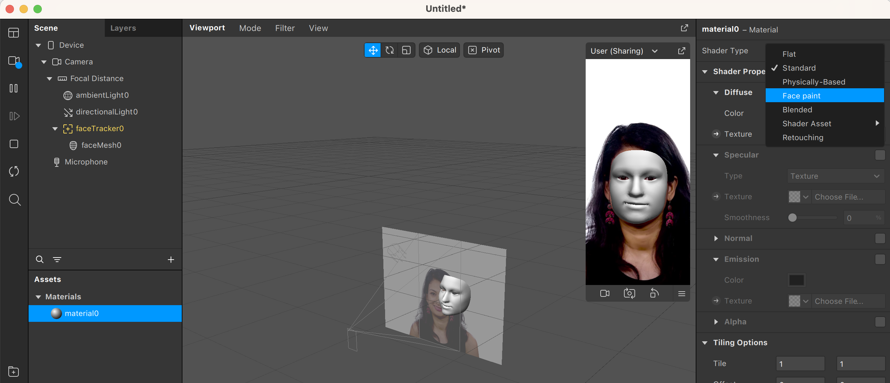
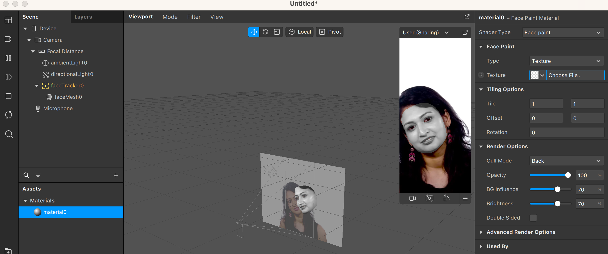
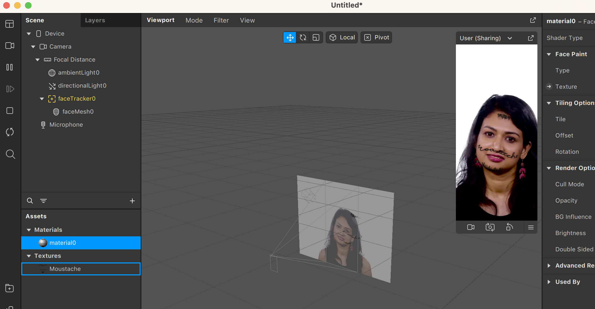

En esta sección, veremos qué herramientas nos ofrece Spark AR para hacer un seguimiento de una cara y poder aplicar efectos en ella.

Antes de empezar, vamos a aclarar qué significa _face tracking_ en este contexto. Spark AR está pensado para desarrollar aplicaciones que se ejecuten en dispositivos móviles, usando la cámara para mostrar información o efectos digitales sobre el mundo real. En el caso de Face Tracking cuando la cámara detecte un rostro, activará las funciones que se hayan programado. Internamente, un sistema de _face tracking_ detecta la posición y orientación de la cara respecto de la cámara, y ofrece esta información a los sistemas que se hayan integrado en la aplicación. Vamos a ver ejemplos prácticos de cómo utilizar el Face Tracking de Spark AR.

Empezaremos abriendo un proyecto nuevo en Spark Studio:

Podéis ver que el proyecto ya viene configurado con un ejemplo de vídeo para simular lo que podría estar viendo una cámara. Añadir _face tracking_ es tan simple como apretar el botón derecho del ratón en la zona de la escena.

Veréis como, después de añadir el _face tracking_, la imagen en el _viewport_ incluye los ejes que indican la orientación del rostro detectado:

Añadir _face tracking_ en sí mismo no tiene mucha utilidad. Ahora vamos a incluir todo lo necesario para que nuestro proyecto produzca un primer efecto en la cara detectada por la cámara. Primero añadimos un _face mesh_, que es una representación 3D de la geometría de la cara detectada. No hay más que apretar el botón derecho encima del _face tracker_ y seleccionar Add Object y Face Mesh.

Ahora usaremos esta geometría añadiendo materiales que quedarán asociados al _face mesh_. Crear un material es tan sencillo como seleccionar el _face mesh_ que acabamos de crear y, en la sección Materials, en el inspector de propiedades, apretar el botón +.

Esta acción crea un material que está asociado al _face mesh_ y que podemos ver en la sección de Assets del proyecto.

Los materiales sirven en esencia para definir texturas y _shaders_. Un _shader_ es un pequeño programa que indica cómo queremos que se visualicen los objetos y sus texturas, aplicando efectos. Un ejemplo clásico de _shaders_ son los que crean efectos de dibujos animados, en contraste con los que intentan generar imágenes realistas. En nuestro caso, seleccionaremos el _shader face paint_, clicando en el material y luego Face paint en el desplegable de Shader Type.

Podréis ver que el efecto del _shader_ resulta en, como indica el nombre, dar la impresión de que se está pintando encima del rostro detectado. Ya solo queda añadir la textura. Qué textura poner depende de vuestra libertad creativa y del efecto que queráis dar. En nuestro caso, simplemente añadiremos un bigote y una barbilla simpáticos. Esta textura la podéis generar a mano, o bien buscarla por internet. En todo caso, para asociarla al material, hay que seleccionar dicho material y, en el apartado Face paint de las propiedades, clicar en Choose file y escoger el fichero que contiene la textura que queremos.

¡Y ya está! Una vez seleccionado, nuestro efecto ya estará terminado.

---
[Página previa](Studio.md) - [página siguiente](Plane-Tracker.md)

# Versió catalana

En aquesta secció veurem quines eines ens ofereix Spark AR per fer un seguiment d'una cara i poder aplicar-hi efectes.

Abans de començar aclarirem què significa _face tracking_ en aquest context. Spark AR està pensat per desenvolupar aplicacions que s'executin en dispositius mòbils usant la càmera per mostrar informació o efectes digitals sobre el món real. En el cas de Face Tracking, quan la càmera detecti un rostre, activarà les funcions que s'hagin programat. Internament, un sistema de _face tracking_ detecta la posició i orientació de la cara respecte de la càmera i ofereix aquesta informació als sistemes que s'hagin integrat en l'aplicació. Veurem exemples pràctics de com utilitzar el Face Tracking d'Spark AR.

Començarem obrint un projecte nou en Spark Studio:

Podeu veure que el projecte ja ve configurat amb un exemple de vídeo per simular el que podria estar veient una càmera. Afegir _face tracking_ és tan simple com prémer el botó dret del ratolí en la zona de l'escena.

Veureu com, després d'afegir el _face tracking_, la imatge del _viewport_ inclou els eixos que indiquen l'orientació del rostre detectat:

Afegir _face tracking_ no té per si mateix molta utilitat. Ara inclourem tot el necessari perquè el nostre projecte produeixi un primer efecte en la cara detectada per la càmera. Primer afegim un _face mesh_, que és una representació en 3D de la geometria de la cara detectada. Només cal prémer el botó dret damunt del _face tracker_ i seleccionar Add Object i Face Mesh.

Ara usarem aquesta geometria afegint materials que quedaran associats al _face mesh_. Crear un material és tan senzill com seleccionar el _face mesh_ que acabem de crear i, en la secció Materials de l'inspector de propietats, prémer el botó +.

Aquesta acció crea un material que està associat al _face mesh_ i que podem veure en la secció d'Assets del projecte.

Els materials serveixen en essència per definir textures i _shaders_. Un _shader_ és un petit programa que indica com volem que es visualitzin els objectes i les seves textures aplicant efectes. Un exemple clàssic de _shaders_ són els que creen efectes de dibuixos animats. En contrast amb ells, intenten generar imatges realistes. En el nostre cas, seleccionarem el _shader face paint_ clicant en el material i després Face paint en el desplegable de Shader Type.

Podreu veure que l'efecte del _shader_ resulta, com indica el nom, en fer l'efecte que s'està pintant damunt del rostre detectat. Ja només queda afegir la textura. La textura que posarem depèn de la vostra llibertat creativa i de l'efecte que vulgueu donar. En el nostre cas, simplement afegirem un bigoti i una barbeta simpàtics. Aquesta textura la podeu generar-la a mà o bé buscar-la per internet. En tot cas, per associar-la al material, cal seleccionar aquest material i, en l'apartat Face paint de les propietats, clicar en Choose file i triar el fitxer que conté la textura que volem.

I ja està! Una vegada seleccionat, el nostre efecte ja estarà acabat.

---
[Pàgina prèvia](Studio.md) - [pàgina següent](Plane-tracker.md)
