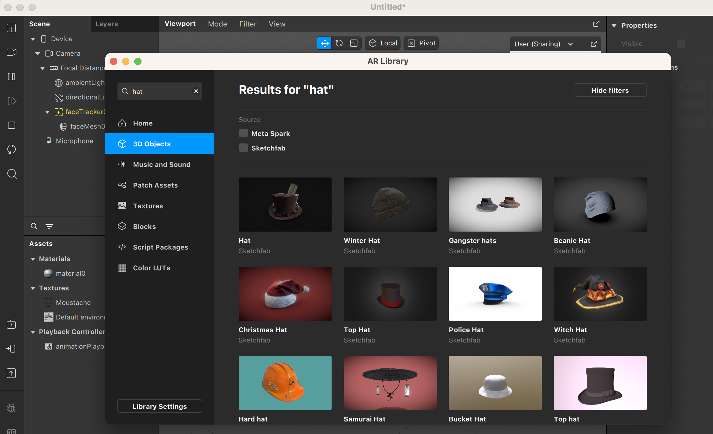
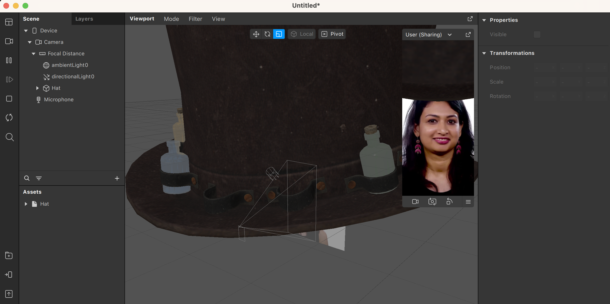
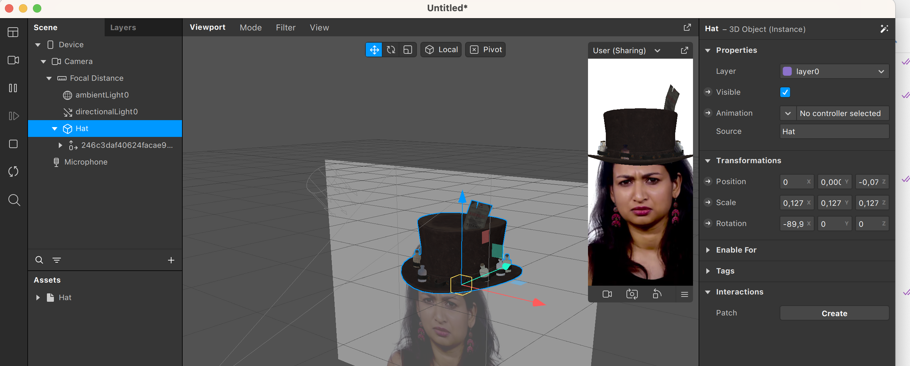
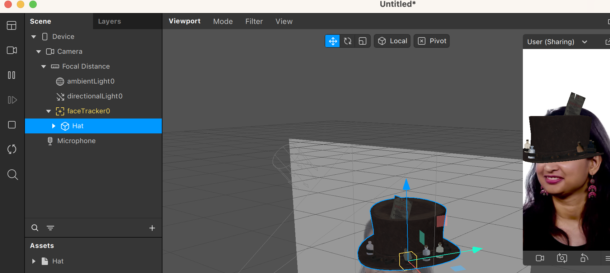
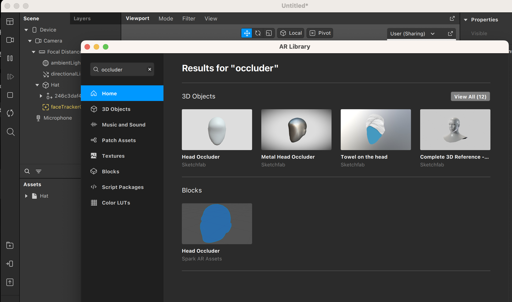
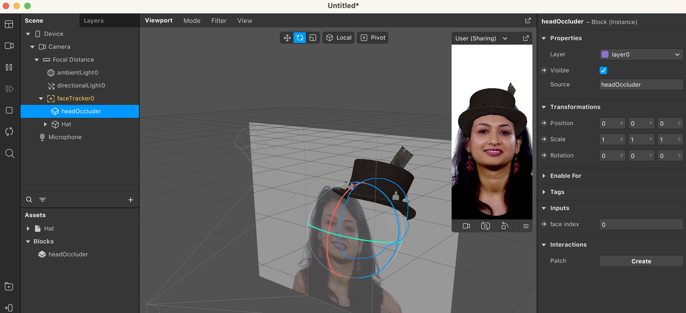

En esta sección, veremos cómo hacer efectos con objetos 3D. Deberéis haber seguido los tutoriales de [Spark Editor](Studio.md) y [Face Tracking](Face-Tracking.md) para poder seguir esta parte sin problemas.

Empecemos por hacer un efecto sencillo con un objeto 3D. Pondremos un sombrero encima de la cabeza que detecte el sistema de [Face Tracking](Face-Tracking.md). 

Antes de empezar, vamos a importar el objeto 3D. Podemos usar cualquier fichero propio, o bien explorar la galería de objetos 3D de Sketchfab o Meta Spark. Para hacer pruebas, recomendamos utilizar estas galerías, ya que contienen una gran cantidad de objetos y la mayoría se pueden descargar de manera gratuita. Accederemos a estas galerías apretando el botón con el símbolo + encima de una carpeta, en la parte inferior izquierda. Seguidamente, podemos usar el buscador situado en la parte superior izquierda para filtrar lo que estamos buscando.

 

Si escogéis un objeto de Sketchfab, tendréis que aceptar las condiciones y luego importar el objeto. En este ejemplo, escogemos un sombrero de copa con un billete del Titanic. Lo podemos añadir a la escena simplemente arrastrándolo desde la sección de Assets a la sección de Scene.

Como podéis comprobar, el sombrero tiene unas dimensiones inadecuadas. Esto se debe a que simplemente se modeló en otra escala (por ejemplo, hay programas de modelado donde cada unidad representa 10 cm y otros donde representa 1 m) y tenemos que ajustarlo a la escala de nuestro proyecto. Una escala de unos 0,12 en cada eje se verá correcta.

Ahora queremos que este objeto se ancle al rostro detectado, en vez que quedarse fijo en el centro de la pantalla. Para ello, necesitaremos un sistema de [Face Tracking](Face-Tracking.md) que añadimos a la escena. Finalmente, simplemente con asignar el sombrero como hijo del _face tracking_, ya se moverá en sincronía con la cabeza 

Pero aquí no acaba nuestro trabajo con el efecto, ya que podéis observar que el sombrero ocluye la cara detectada. Spark AR nos ofrece una solución con el objeto Head Occluder, que podremos encontrar en la galería:

 

Añadiendo este objeto a la escena y situándolo como hijo del _face tracker_, veréis que Spark AR genera una malla en la posición de la cabeza (delineada en azul) y ocluye la parte trasera del sombrero. 

Ya solo nos queda situar y orientar correctamente el sombrero para que el efecto se vea sin fallos. En nuestro ejemplo, unas coordenadas que funcionan son (0; 0,05; -0,1) para _x_, _y_, _z_, con la rotación (-100; 0; 0).

¡Y ya está completado nuestro ejemplo!

---
[Página previa](Plane-Tracker.md) - [página siguiente](Animaciones.md)

# Versió catalana

En aquesta secció veurem com podem fer efectes amb objectes en 3D. Haureu d'haver seguit els tutorials de [Spark Editor](Studio.md) i [Face Tracking](Face-tracking.md) per poder seguir aquesta part sense problemes.

Comencem per fer un efecte senzill amb un objecte en 3D. Posarem un barret damunt del cap que detecti el sistema de [Face Tracking](Face-tracking.md). 

Abans de començar, importarem l'objecte en 3D. Podem usar qualsevol fitxer propi o bé explorar la galeria d'objectes en 3D d'Sketchfab o Meta Spark. Per fer proves, recomanem utilitzar aquestes galeries, ja que contenen una gran quantitat d'objectes i la majoria es poden descarregar de manera gratuïta. Accedirem a aquestes galeries prement el botó amb el símbol + damunt d'una carpeta, en la part inferior esquerra. Seguidament, podem usar el cercador situat en la part superior esquerra per filtrar el que estem buscant.

 

Si trieu un objecte d'Sketchfab, haureu d'acceptar les condicions i després importar l'objecte. En aquest exemple, triem un barret de copa amb un bitllet del Titanic. Ho podem afegir a l'escena simplement arrossegant-ho des de la secció d'Assets fins a la secció de Scene.

Com podeu comprovar, el barret té unes dimensions inadequades. Això es deu al fet que simplement es va modelar en una altra escala (per exemple, hi ha programes de modelatge on cada unitat representa 10 cm i uns altres on representa 1 m), i hem d'ajustar-ho a l'escala del nostre projecte. Una escala d'uns 0,12 en cada eix es veurà correcta.

Ara volem que aquest objecte s'ancori al rostre detectat en comptes de quedar-se fix en el centre de la pantalla. Per a això, necessitarem un sistema de [Face Tracking](Face-tracking.md), que afegim a l'escena. Finalment, simplement assignant el barret com a fill del _face tracking_ ja es mourà en sincronia amb el cap. 

Però aquí no acaba el nostre treball amb l'efecte, ja que podeu observar que el barret oculta la cara detectada. Spark AR ens ofereix una solució amb l'objecte Head Occluder, que podrem trobar en la galeria:

 

Afegint aquest objecte a l'escena i situant-lo com a fill del _face tracker_, veureu que Spark AR genera una malla en la posició del cap (delineada en blau) i oculta la part posterior del barret. 

Ja només ens queda situar i orientar correctament el barret perquè l'efecte es vegi sense errors. En el nostre exemple, unes coordenades que funcionen són (0; 0,05; -0,1) per _x_, _i_, _z_, amb la rotació (-100; 0; 0).

I ja està completat el nostre exemple!

---
[Pàgina prèvia](Plane-tracker.md) - [pàgina següent](Animaciones.md)
