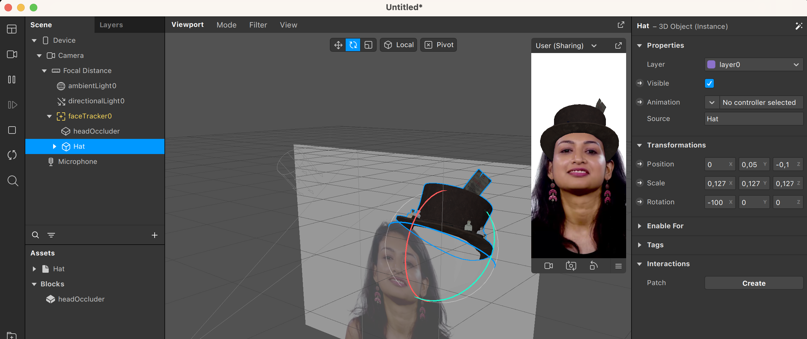

En esta sección, veremos cómo hacer efectos con objetos 3D. Deberéis haber seguido los tutoriales de [Spark Editor](Spark-AR/Studio) y [Face Tracking](Spark-AR/Face-Tracking) para poder seguir esta parte sin problemas.

Empecemos por hacer un efecto sencillo con un objeto 3D. Pondremos un sombrero encima de la cabeza que detecte el sistema de [Face Tracking](Spark-AR/Face-Tracking). 

Antes de empezar, vamos a importar el objeto 3D. Podemos usar cualquier fichero propio, o bien explorar la galería de objetos 3D de Sketchfab o Meta Spark. Para hacer pruebas, recomendamos utilizar estas galerías, ya que contienen una gran cantidad de objetos y la mayoría se pueden descargar de manera gratuita. Accederemos a estas galerías apretando el botón con el símbolo + encima de una carpeta, en la parte inferior izquierda. Seguidamente, podemos usar el buscador situado en la parte superior izquierda para filtrar lo que estamos buscando  

Si escogéis un objeto de Sketchfab, tendréis que aceptar las condiciones y luego importar el objeto. En este ejemplo, escogemos un sombrero de copa con un billete del Titanic. Lo podemos añadir a la escena simplemente arrastrándolo desde la sección de Assets a la sección de Scene.

Como podéis comprobar, el sombrero tiene unas dimensiones inadecuadas. Esto se debe a que simplemente se modeló en otra escala (por ejemplo, hay programas de modelado donde cada unidad representa 10 cm y otros donde representa 1 m) y tenemos que ajustarlo a la escala de nuestro proyecto. Una escala de unos 0,12 en cada eje se verá correcta.

Ahora queremos que este objeto se ancle al rostro detectado, en vez que quedarse fijo en el centro de la pantalla. Para ello, necesitaremos un sistema de [Face Tracking](Spark-AR/Face-Tracking) que añadimos a la escena. Finalmente, simplemente con asignar el sombrero como hijo del _face tracking_, ya se moverá en sincronía con la cabeza 

Pero aquí no acaba nuestro trabajo con el efecto, ya que podéis observar que el sombrero ocluye la cara detectada. Spark AR nos ofrece una solución con el objeto Head Occluder, que podremos encontrar en la galería:

 

Añadiendo este objeto a la escena y situándolo como hijo del _face tracker_, veréis que Spark AR genera una malla en la posición de la cabeza (delineada en azul) y ocluye la parte trasera del sombrero. 

Ya solo nos queda situar y orientar correctamente el sombrero para que el efecto se vea sin fallos. En nuestro ejemplo, unas coordenadas que funcionan son (0; 0,05; -0,1) para _x_, _y_, _z_, con la rotación (-100; 0; 0).

¡Y ya está completado nuestro ejemplo!

---
[Página previa](README.md) - [página siguiente](Animaciones.md)
