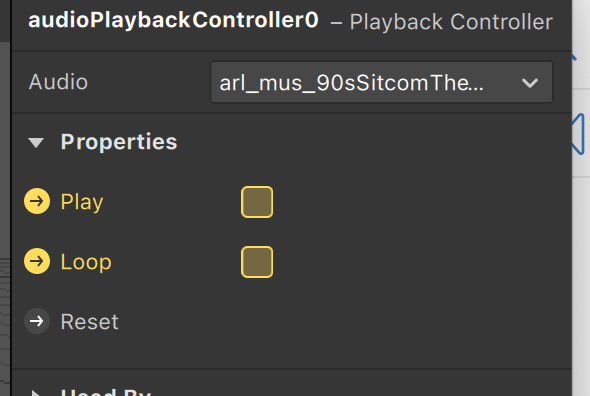
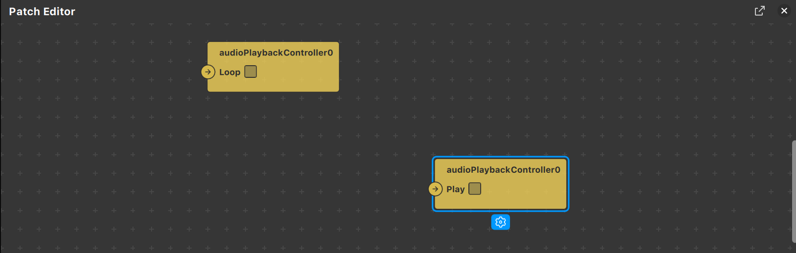
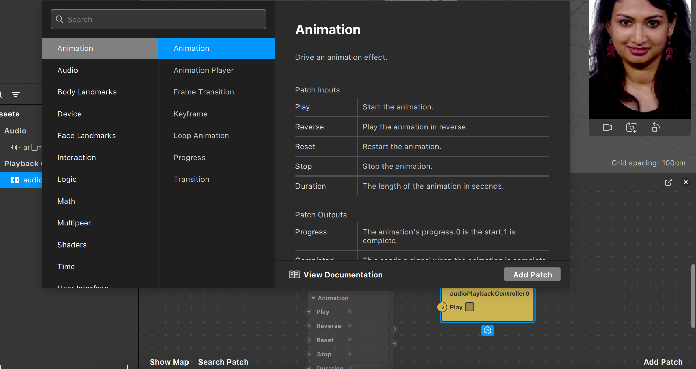
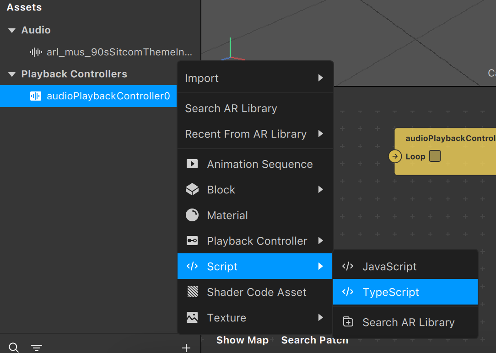
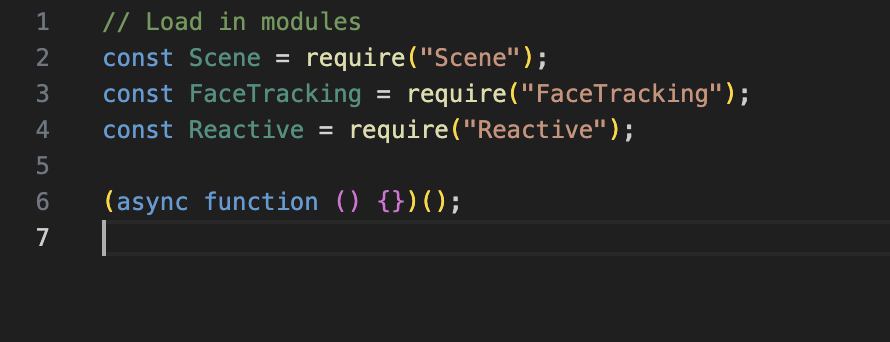
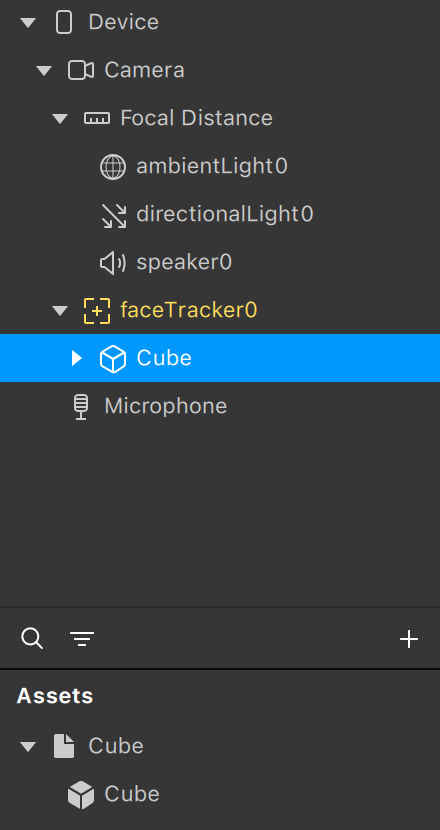
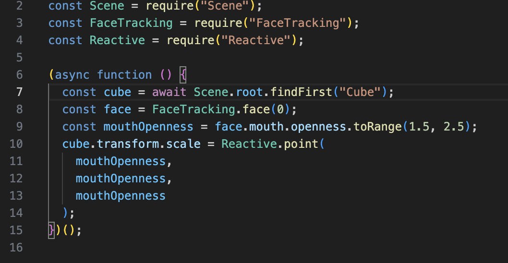
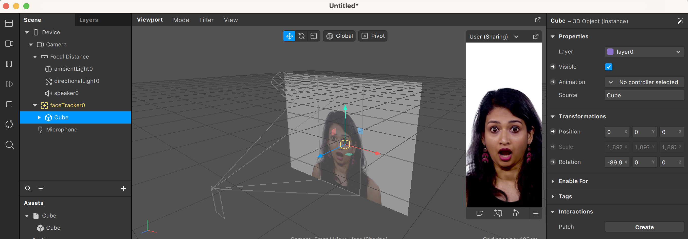

En esta sección, veremos cómo añadir complejidad a nuestros efectos mediante el Patch Editor. 

Esta herramienta nos permite de manera visual poder editar propiedades sin necesidad de código. 

Esta parte del editor se basa en conectar nodos. Cada nodo es o bien una acción, o bien una propiedad de un _asset_ o de un objeto en la escena que podemos modificar. Si seleccionamos un _asset_ (u objeto en la escena) y hacemos clic sobre el icono de la flecha de alguna de las propiedades, nos aparecerá en el Patch Editor.

Haciendo clic derecho podemos acceder al menú donde veremos qué acciones podemos añadir al Patch Editor.

Como podréis ver, hay muchísimas opciones y no sería practicable explicarlas todas en un tutorial. En la sección de [Animaciones](Animaciones.md) veréis un ejemplo de cómo utilizar algunas de las acciones disponibles, como por ejemplo hacer que una animación se repita.

- Scripting en Spark

Para hacer efectos complejos, normalmente requeriremos programación. Spark AR ofrece esa posibilidad mediante JavaScript o TypeScript. En este tutorial no haremos una iniciación al lenguaje, sino que daremos por supuesto un mínimo conocimiento. Para añadir un _script_ simplemente tenemos que hacer clic derecho en la sección de Assets y seleccionar Add Asset, Script y luego el lenguaje que prefiráis. 

El fichero creado por defecto contiene muchas líneas innecesarias, las podemos eliminar y dejar tan solo este código:

Vamos a hacer un ejemplo sencillo de _scripting_ para mostrar las posibilidades de la programación. 

Primero añadiremos un _face tracker_ en la escena. Seguidamente, pondremos un cubo en Assets y lo incluiremos en la escena. Este cubo lo nombraremos «Cube» y lo emparentaremos con el _face tracker_.

Ahora, creamos un _script_ en JavaScript y escribiremos el siguiente código:

Como veréis, la primera instrucción busca en la escena un objeto que se llame «Cube». La segunda usa la API de Face Tracking para obtener la primera cara detectada por el sistema. Como podéis ver, `face` tiene propiedades muy interesantes, en este link podéis ver todo lo que ofrece la API (https://sparkar.facebook.com/ar-studio/learn/reference/classes/facetrackingmodule.mouth). En nuestro caso, detectamos cuánto está de abierta la boca del rostro detectado. Ese valor lo aprovechamos para cambiar de escala el cubo en la operación final. Cabe decir que `toRange(1.5, 2.5)` transforma los valores del rango 0-1 a 1,5-2,5.

¡Y ya está! Solo por tener este _script_, la apertura de la boca controlará la escala del cubo.

Podéis ver toda la API de _scripting_ para Spark AR, con la que podréis desarrollar hasta los efectos más espectaculares: https://sparkar.facebook.com/ar-studio/learn/reference/scripting/summary/.

---
[Página previa](Animaciones.md) - [página siguiente](Segmentación.md)

# Versió catalana

En aquesta secció veurem com podem afegir complexitat als nostres efectes mitjançant el Patch Editor. 

Aquesta eina ens permet de manera visual poder editar propietats sense necessitat de codi. 

Aquesta part de l'editor es basa a connectar nodes. Cada node és o bé una acció o bé una propietat d'un _asset_ o d'un objecte en l'escena que podem modificar. Si seleccionem un _asset_ (o objecte en l'escena) i fem clic sobre la icona de la fletxa d'alguna de les propietats, ens apareixerà en el Patch Editor.

Fent clic dret, podem accedir al menú on veurem quines accions podem afegir al Patch Editor.

Com podreu veure, hi ha moltíssimes opcions i no seria practicable explicar-les totes en un tutorial. En la secció de [Animacions](Animaciones.md) veureu un exemple de com utilitzar algunes de les accions disponibles, com per exemple fer que una animació es repeteixi.

- Scripting en Spark

Per fer efectes complexos, normalment requerirem programació. Spark AR ofereix aquesta possibilitat mitjançant JavaScript o TypeScript. En aquest tutorial no farem una iniciació al llenguatge, sinó que donarem per descomptat un mínim coneixement. Per afegir un _script_, simplement hem de fer clic dret en la secció d'Assets i seleccionar Add Asset, Script i després el llenguatge que es prefereixi. 

El fitxer creat per defecte conté moltes línies innecessàries. Podem eliminar-les i deixar tan sols aquest codi:

Farem un exemple senzill de _scripting_ per mostrar les possibilitats de la programació. 

Primer afegirem un _face tracker_ en l'escena. Seguidament, posarem un cub en Assets i l'inclourem en l'escena. Aquest cub el nomenarem «Cube» i l'emparentarem amb el _face tracker_.

Ara crearem un _script_ en JavaScript i escriurem el codi següent:

Com veureu, la primera instrucció busca en l'escena un objecte que s'anomeni «Cube». La segona usa l'API de Face Tracking per obtenir la primera cara detectada pel sistema. Com podeu veure, `face` té propietats molt interessants. En aquest link podeu veure tot el que ofereix l'API: https://sparkar.facebook.com/ar-studio/learn/reference/classes/facetrackingmodule.mouth. En el nostre cas, detectem quant està d'oberta la boca del rostre detectat. Aquest valor l'aprofitem per canviar d'escala el cub en l'operació final. Cal dir que `toRange(1.5, 2.5)` transforma els valors del rang 0-1 a 1,5-2,5.

I ja està! Només per tenir aquest _script_, l'obertura de la boca controlarà l'escala del cub.

Podeu veure tota l'API d'_scripting_ per a Spark AR, amb la qual podreu desenvolupar fins els efectes més espectaculars: https://sparkar.facebook.com/ar-studio/learn/reference/scripting/summary/.

---
[Pàgina prèvia](Animaciones.md) - [pàgina següent](Segmentación.md)
