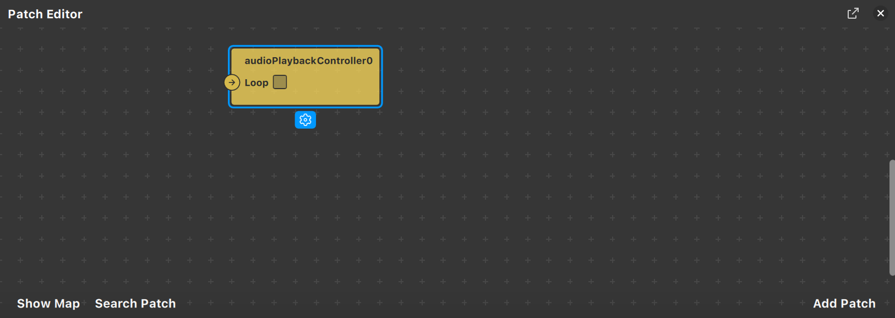

En esta sección, veremos cómo añadir complejidad a nuestros efectos mediante el Patch Editor. 

Esta herramienta nos permite de manera visual poder editar propiedades sin necesidad de código. 

Esta parte del editor se basa en conectar nodos. Cada nodo es o bien una acción, o bien una propiedad de un _asset_ o de un objeto en la escena que podemos modificar. Si seleccionamos un _asset_ (u objeto en la escena) y hacemos clic sobre el icono de la flecha de alguna de las propiedades, nos aparecerá en el Patch Editor.

Haciendo clic derecho podemos acceder al menú donde veremos qué acciones podemos añadir al Patch Editor.

Como podréis ver, hay muchísimas opciones y no sería practicable explicarlas todas en un tutorial. En la sección de [Animaciones](Spark-AR/Animaciones) veréis un ejemplo de cómo utilizar algunas de las acciones disponibles, como por ejemplo hacer que una animación se repita.

- Scripting en Spark

Para hacer efectos complejos, normalmente requeriremos programación. Spark AR ofrece esa posibilidad mediante JavaScript o Typescript. En este tutorial no haremos una iniciación al lenguaje, sino que daremos por supuesto un mínimo conocimiento. Para añadir un _script_ simplemente tenemos que hacer clic derecho en la sección de Assets y seleccionar Add Asset, Script y luego el lenguaje que prefiráis. 

El fichero creado por defecto contiene muchas líneas innecesarias, las podemos eliminar y dejar tan solo este código:

Vamos a hacer un ejemplo sencillo de _scripting_ para mostrar las posibilidades de la programación. 

Primero añadiremos un _face tracker_ en la escena. Seguidamente, pondremos un cubo en Assets y lo incluiremos en la escena. Este cubo lo nombraremos «Cube» y lo emparentaremos con el _face tracker_.

Ahora, creamos un _script_ en JavaScript y escribiremos el siguiente código:

Como veréis, la primera instrucción busca en la escena un objeto que se llame «Cube». La segunda usa la API de Face Tracking para obtener la primera cara detectada por el sistema. Como podéis ver, `face` tiene propiedades muy interesantes, en este link podéis ver todo lo que ofrece la API (https://sparkar.facebook.com/ar-studio/learn/reference/classes/facetrackingmodule.mouth). En nuestro caso, detectamos cuánto está de abierta la boca del rostro detectado. Ese valor lo aprovechamos para cambiar de escala el cubo en la operación final. Cabe decir que `toRange(1.5, 2.5)` transforma los valores del rango 0-1 a 1,5-2,5.

¡Y ya está! Solo por tener este _script_, la apertura de la boca controlará la escala del cubo.

Podéis ver toda la API de _scripting_ para Spark AR, con la que podréis desarrollar hasta los efectos más espectaculares: https://sparkar.facebook.com/ar-studio/learn/reference/scripting/summary/.

---
[Página previa](Animaciones.md) - [página siguiente](Segmentación.md)
