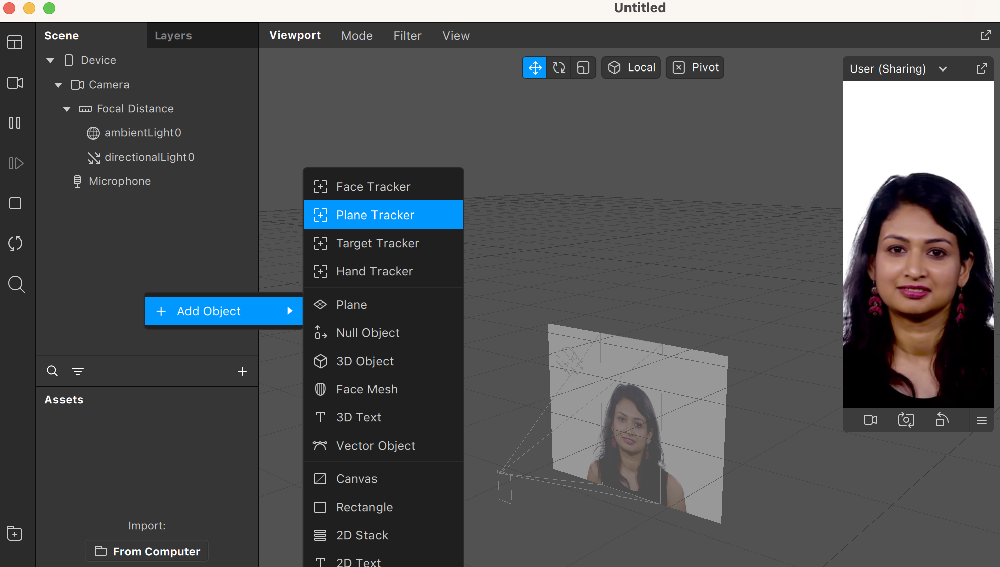
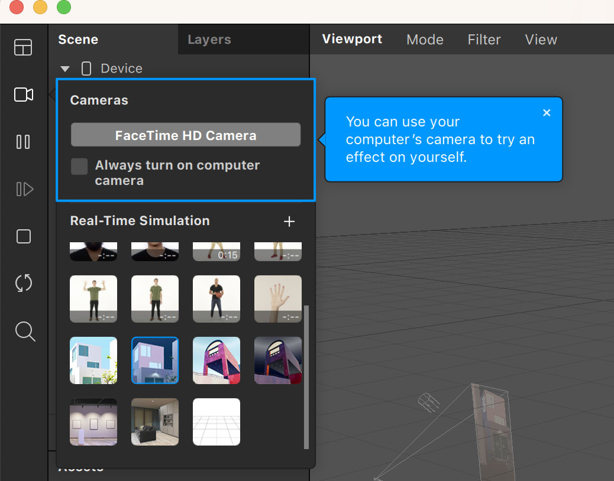
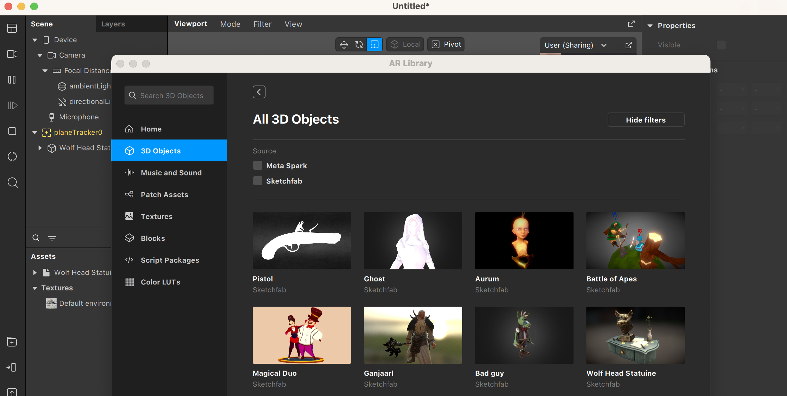
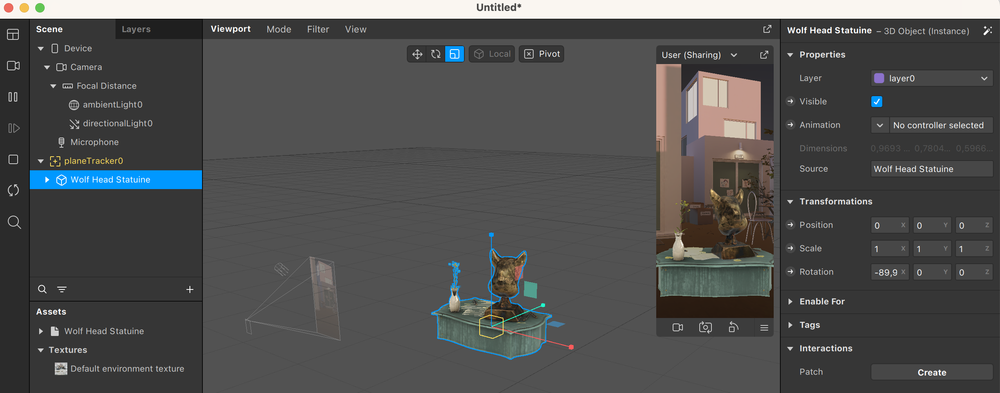

En esta sección, veremos cómo utilizar Plane Tracker en Spark AR para detectar superficies planas. El concepto es similar al [_face tracking_](Spark-AR/Face-Tracking) que hemos visto en la sección correspondiente, ya que ese sistema utiliza la cámara para detectar un rostro y ejecutar acciones, mientras que un _plane tracker_ detecta una superficie plana para ejecutar las acciones que hayamos programado en nuestro efecto.

El primer paso es añadir un _plane tracker_ a la escena:

Como hemos dicho, este _plane tracker_ es un sistema que usa Spark AR para detectar una superficie plana horizontal. Por lo tanto, las coordenadas del plano no se pueden definir, sino que se ajustarán cuando se detecte el plano. Spark AR nos ofrece una interfaz WASD (los botones del teclado) para poder simular el movimiento de la cámara en el espacio, y también simulaciones de entornos, para no tener que estar probando nuestro efecto en un dispositivo cada vez. En nuestro caso, nos interesa escoger una simulación de un entorno que tenga una superficie horizontal plana, y podemos escoger de entre varias simulaciones clicando en el icono de la cámara.

Una vez seleccionada, vamos a importar un objeto 3D a la escena. Podéis ver más detalles de cómo hacer este proceso en la sección [Objetos 3D](Spark-AR/3D). En todo caso, clicando en el botón con el símbolo + encima de una carpeta en la parte inferior izquierda, se abre un catálogo de objetos 3D para importar.

En nuestro ejemplo hemos escogido el objeto Wolf Head Statuine y, al hacerlo, nos aparece en la sección de Assets. Lo añadimos a la escena arrastrándolo a la sección de Scene y lo situamos como hijo del _plane tracker_:

De esta manera, el objeto se quedará fijo respecto al plano, mientras la cámara se mueve alrededor del espacio. ¡Y ya tenemos nuestro efecto con un _plane tracker_! Es posible que haga falta ajustar cuestiones como la rotación o escala del objeto en la escena. Es normal, ya que a veces los objetos están modelados con dimensiones diferentes (por ejemplo, pulgadas frente a centímetros) y hay que ajustar la escala.

---
[Página previa](README.md) - [página siguiente](Plane-Tracker.md)
