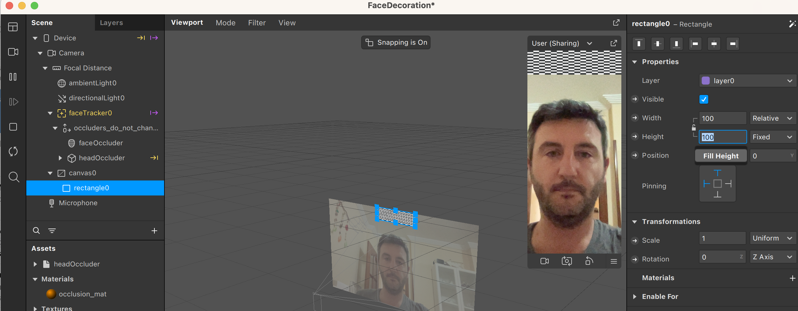
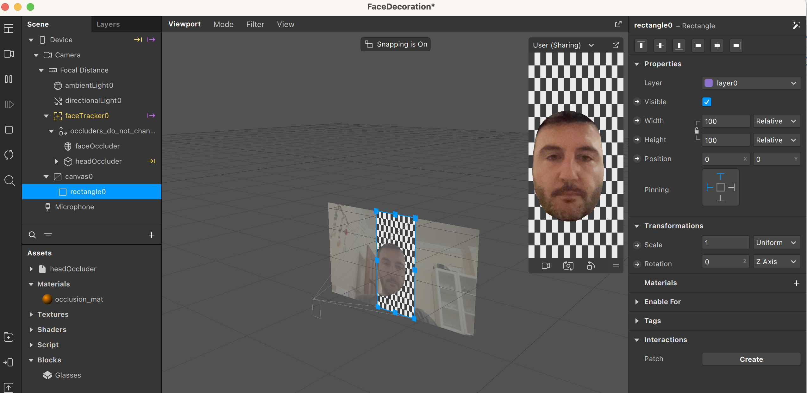
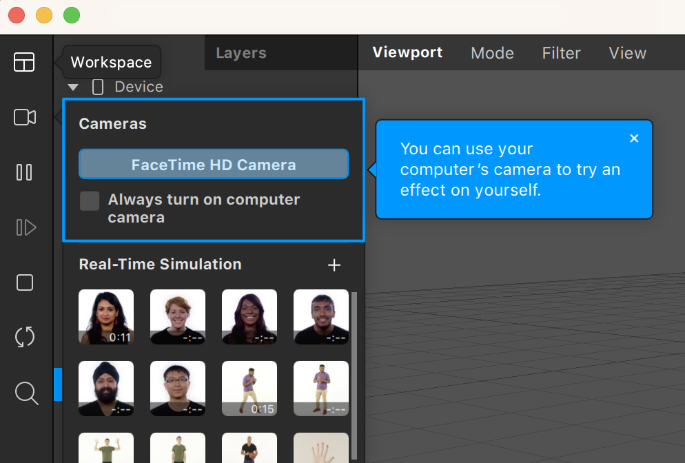
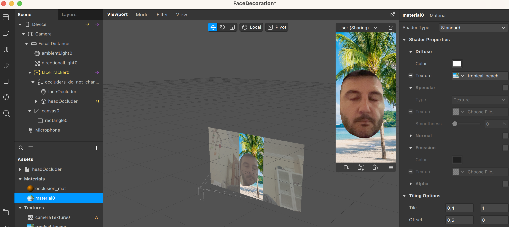

En esta sección veremos cómo implementar una de las funcionalidades más populares de los efectos de Spark: la segmentación

Con este término nos referimos a aquellos efectos que distingan el fondo de objetos en primer plano. Normalmente en primer plano solemos tener a personas, y queremos cambiar el fondo. A continuación haremos un ejemplo de esto.

Vamos a empezar con un proyecto de ejemplo, el Face Decoration, y en la sección de Scene añadiremos un ractángulo  Queremos que este rectángulo ocupe toda la pantalla, con lo que editaremos las propiedades de width y height para que rellenen todo el espacio con Fill width y Fill Height  Es posible que los ejemplos de Spark AR no funcionen bien y tengáis que habilitar la cámara de vuestro ordenador.  Una vez hechos estos pasos, vamos a crear un material para el rectángulo. 

Una vez creado, vamos a ponerle una imágen como textura, podéis usar la que queráis. Será lo que se muestre de fondo

Ahora seleccionamos la cámara, añadiremos un Segmentation, que es el sistema de Spark para reconocer caras y personas. 

Finalmente, sólo queda seleccionar de nuevo el material, activar el Alpha, seleccionar la textura segmentationMask (que la acabamos de crear en la operación anterior), e invertir el Alpha

Y ya tenemos nuestro efecto de segmentación!