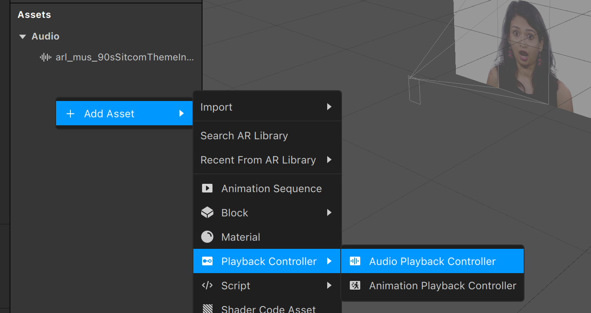
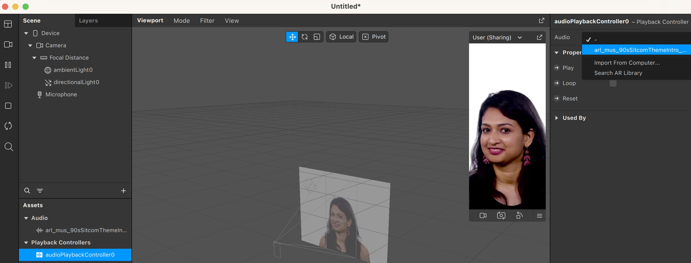
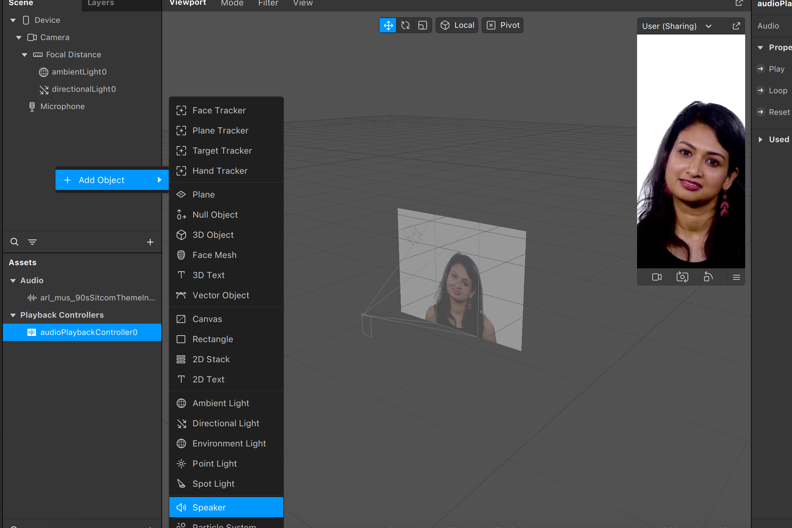
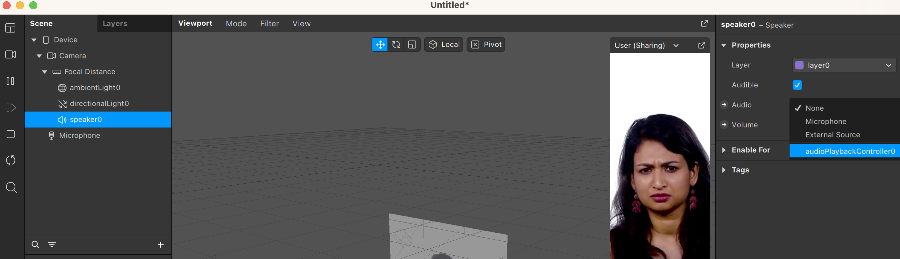
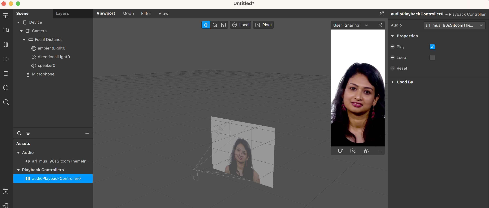

En esta sección vamos a aprender a añadir efectos de sonido

Empezaremos con un proyecto vacío, e importaremos algún archivo de sonido de la librería de Spark. A continuación, crearemos en la sección de Assets un Audio Playback Controller

 Este controlador necesita ser configurado para decirle qué audio tiene que reproducir. Para ello, vamos a las propiedades y en el desplegable de Audio seleccionamos el archivo que acabamos de importar  Seguidamente, hay que configurar la escena para que este controlador esté presente. En concreto, tenemos que añadir un Speaker, que es lo que le indica a Spark que la escena tiene sonido  Como un proyecto puede tener varios controladores de sonido, hay que configurar el Speaker que acabamos de crear para que utilice el controlador que hemos añadido anteriormente Ya sólo nos queda indicarle al controlador que haga Play para que se escuche en la escena!

