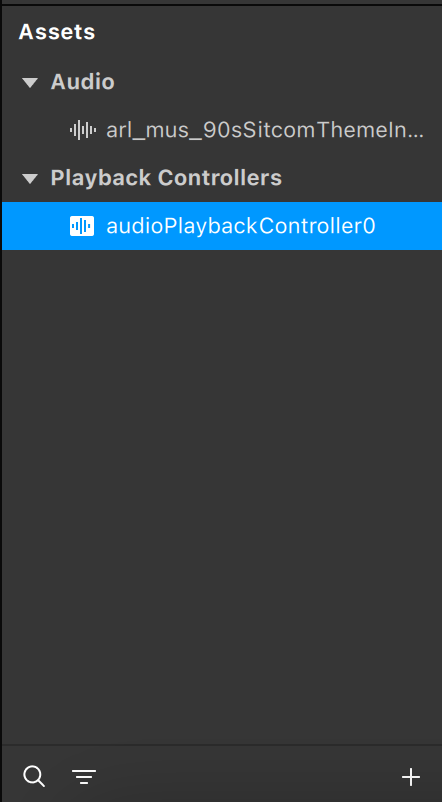
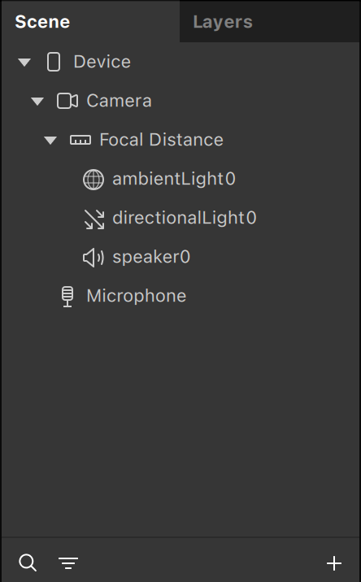
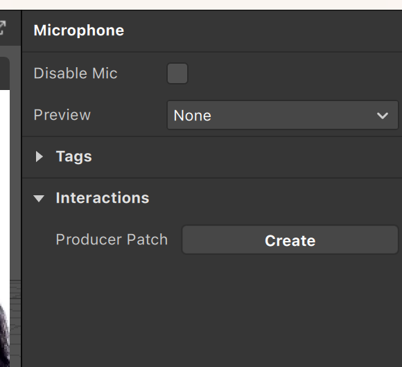
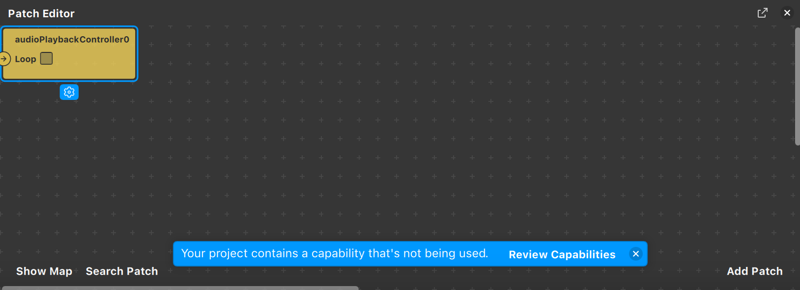
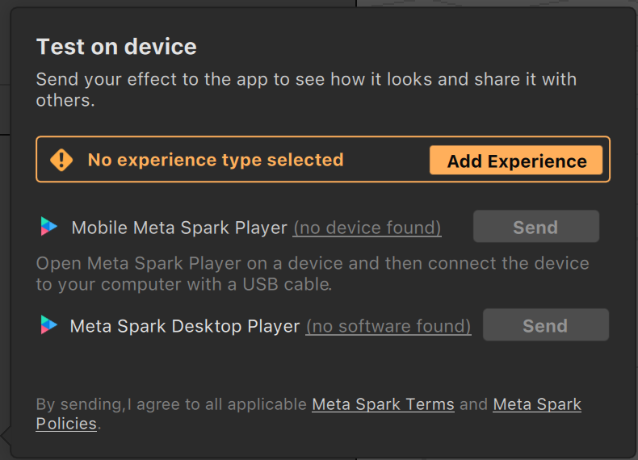

En esta sección veremos cómo navegar la interfaz de Spark Studio. Es importante conocer para qué sirve cada sección y poder orientarnos rápidamente.

- Assets: la gran mayoría de los editores de aplicaciones gráficas tienen la misma estructura. Hay una sección donde tenemos todos los recursos disponibles para utilizarlos y se suele llamar Assets. Spark usa esta nomenclatura también. Pero estos recursos no están organizados de manera que afectan directamente a la experiencia, sino que simplemente están disponibles para usar.

- Scene: la definición de qué recursos utiliza la experiencia y cómo está estructurada se suele incluir en una sección llamada Scene. De nuevo, Spark Studio. Un proyecto puede contener varias escenas para definir múltiples efectos. De esta manera, no tenemos que mantener múltiples proyectos con recursos distintos y trabajar solo en uno.

- Propiedades: cada recurso, tanto en la sección de Assets como en la sección de Scene, puede tener diversas propiedades. Estas se pueden configurar en la parte derecha del editor y dependerán de qué esté seleccionado en Assets o Scene. En el caso de la imagen que se muestra a continuación, hemos seleccionado el micrófono:
 
 

- Patch Editor: para crear efectos complejos, Spark Studio nos ofrece una herramienta donde visualmente podremos crear comportamientos avanzados. Se trata de una interfaz donde conectaremos nodos unos con otros y donde cada nodo representa o bien una acción, o bien una propiedad afectada por la acción. En el tutorial de Patch Editor veréis con más detalle esta sección:

- Exportar: los efectos se pueden probar en el dispositivo que tengamos. Para ello, debemos bajar e instalar en el teléfono las aplicaciones que nos indica Spark Studio.

Una vez probadas, se pueden publicar clicando en el botón de Publish y siguiendo las instrucciones.

---
[Página previa](README.md) - [página siguiente](Face-Tracking.md)

# Versió catalana

En aquesta secció veurem com podem navegar amb la interfície d'Spark Studio. És important conèixer per a què serveix cada secció i poder orientar-nos ràpidament.

- Assets. La gran majoria dels editors d'aplicacions gràfiques tenen la mateixa estructura. Hi ha una secció on tenim tots els recursos disponibles per utilitzar i que se sol anomenar Assets. Spark també usa aquesta nomenclatura. Però aquests recursos no estan organitzats de manera que afecten directament l'experiència, sinó que simplement estan disponibles per usar.

- Scene. La definició de quins recursos utilitza l'experiència i com està estructurada se sol incloure en una secció anomenada Scene. De nou, utilitzem Spark Studio. Un projecte pot contenir diverses escenes per definir diversos efectes. D'aquesta manera, no hem de mantenir diversos projectes amb recursos diferents i treballar només en un.

- Propietats. Cada recurs, tant en la secció d'Assets com en la secció d'Scene, pot tenir diverses propietats. Aquestes propietats es poden configurar en la part dreta de l'editor i dependran del que estigui seleccionat a Assets o Scene. En el cas de la imatge que es mostra a continuació, hem seleccionat el micròfon:
 
 

- Patch Editor. Per crear efectes complexos, Spark Studio ens ofereix una eina en la qual visualment podrem crear comportaments avançats. Es tracta d'una interfície on connectarem nodes els uns amb els altres i on cada node representa o bé una acció o bé una propietat afectada per l'acció. En el tutorial de Patch Editor veureu amb més detalls aquesta secció:

- Exportar. Els efectes es poden provar en el dispositiu que tinguem. Per a això, hem de baixar i instal·lar en el telèfon les aplicacions que ens indica Spark Studio.

Una vegada provades, es poden publicar clicant en el botó de Publish i seguint les instruccions.

---
[Pàgina prèvia](README.md) - [pàgina següent](Face-Tracking.md)
